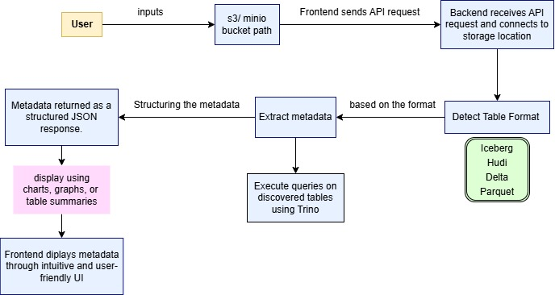

Metastore Viewer – Architecture
📌 Overview
The Metastore Viewer is a web-based tool designed to fetch and display metadata from Parquet, Iceberg, Delta, and Hudi tables stored in S3, Azure Blob Storage, and MinIO. The system consists of a FastAPI backend, an optional web UI, and integrations with cloud storage providers.

🏛 System Architecture
The project follows a modular architecture with the following key components:

Client
A React.js frontend for interacting with the API
Displays table metadata in a structured format

API Layer (FastAPI Backend)
Exposes RESTful endpoints to fetch metadata
Processes user requests and interacts with the storage layer

Metadata Extraction Layer
Uses libraries like PyArrow, PyIceberg, Delta Lake to parse table schemas
Retrieves partition information and metadata properties

Storage Integration Layer
Interfaces with S3, Azure, MinIO using SDKs (boto3, azure-storage-blob, MinIO SDK)
Fetches file structure and metadata from object stores

Caching & Optimization
Stores frequently accessed metadata in Redis/PostgreSQL to reduce API latency
Implements background tasks to refresh cached data

Data Flow:

1. User Request: A client (web UI or API consumer) sends a request to fetch metadata.
2. API Processing: The FastAPI backend processes the request and determines the table format.
3. Storage Query: The backend interacts with S3, Azure, or MinIO to retrieve file metadata.
4. Metadata Parsing: PyArrow/PyIceberg/Delta Lake extract schema, partitions, and table properties.
5. Response Generation: The processed metadata is returned as a JSON response to the client.

Detailed Architecture Diagram

