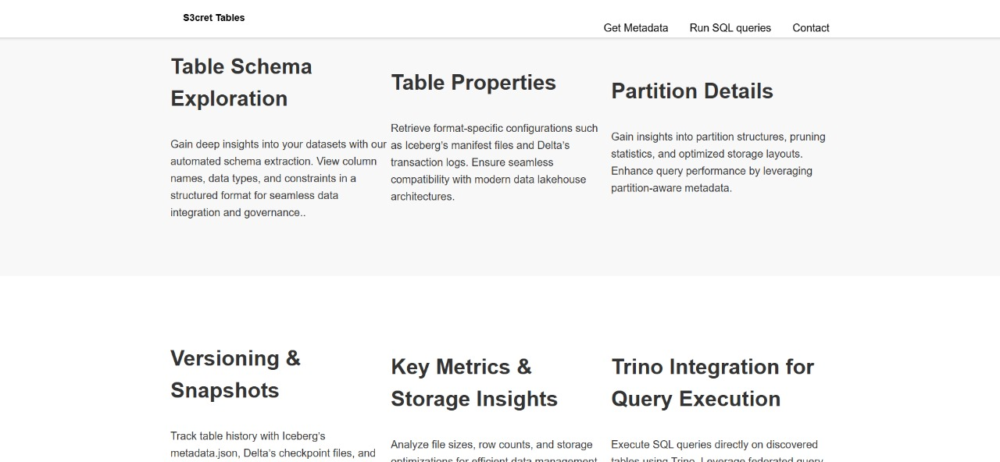
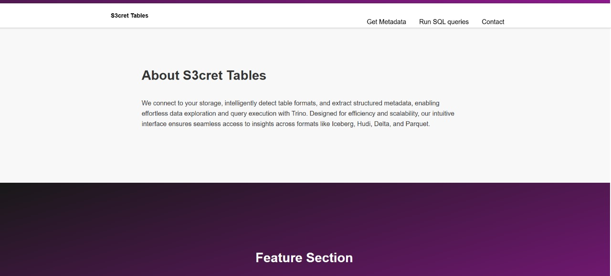
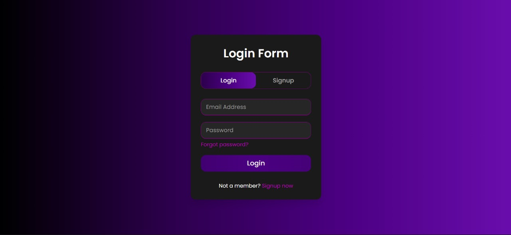

Introduction
The Metastore Viewer is a web-based tool designed to retrieve and display metadata from Parquet, Iceberg, Delta, and Hudi tables stored in S3, Azure Blob Storage, and MinIO. It provides an interactive interface for users to explore table structures, partitions, and schema details.

Features
✔ Fetch and display metadata from different storage backends
✔ Support for Parquet, Iceberg, Delta, and Hudi table formats
✔ Search and filter functionalities for easy metadata exploration
✔ Interactive and user-friendly web UI (optional)
✔ FastAPI backend for efficient API-based access

User Interface
Below are the UI prototypes showcasing different sections of the Metastore Viewer.

🔹 Landing Page
The landing page contains the descriptions and features.

🔹 Login
User can login to store history and table data.

🔹DashBoard
Showing the schema, partitions, and metadata properties of a selected table.

How It Works
1️⃣ User selects a storage backend (S3, Azure, MinIO).
2️⃣ The system fetches the list of available tables.
3️⃣ Users can browse tables, view metadata, and apply filters.
4️⃣ Data is fetched via the FastAPI backend and displayed in a structured format.
